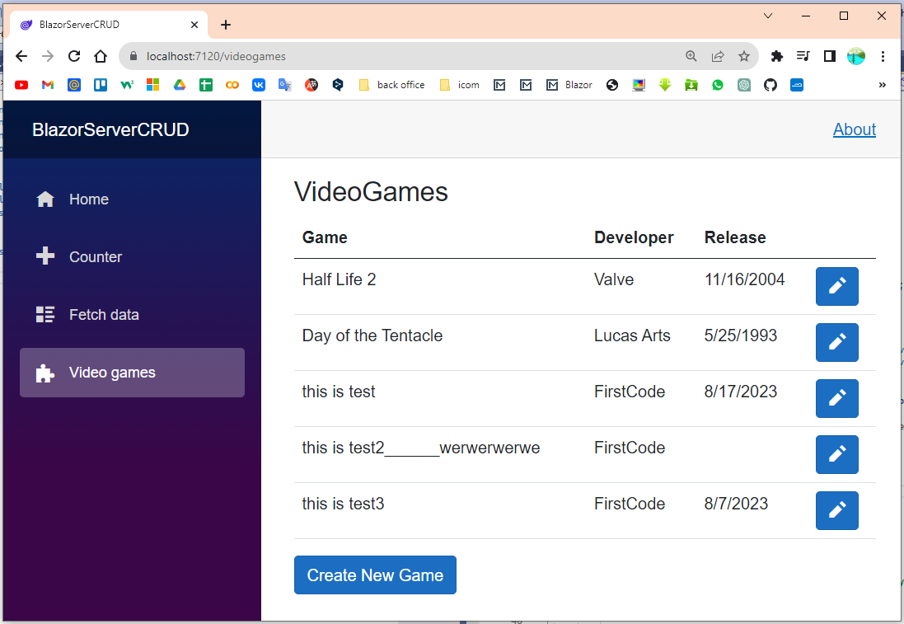
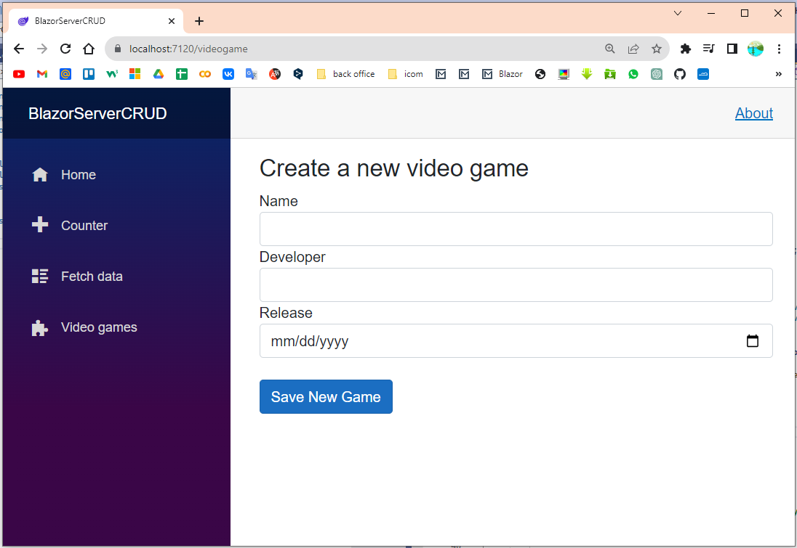
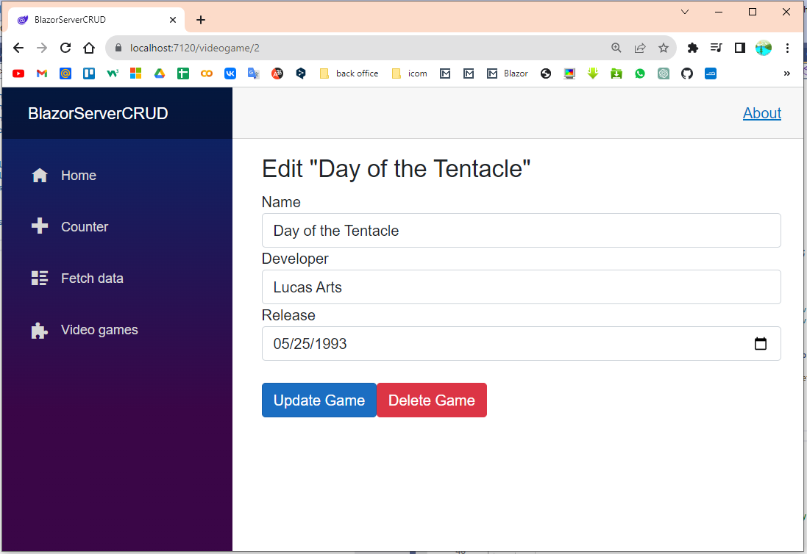

Blazor Server web app
Connection with DB through Entity Framework. Basic operation CRUD in asynchronous form.

Blazor Server CRUD with .NET 6 & Entity Framework
https://github.com/patrickgod/BlazorServerCRUD
https://www.youtube.com/watch?v=ii6QzWudZ6E&ab_channel=PatrickGod

