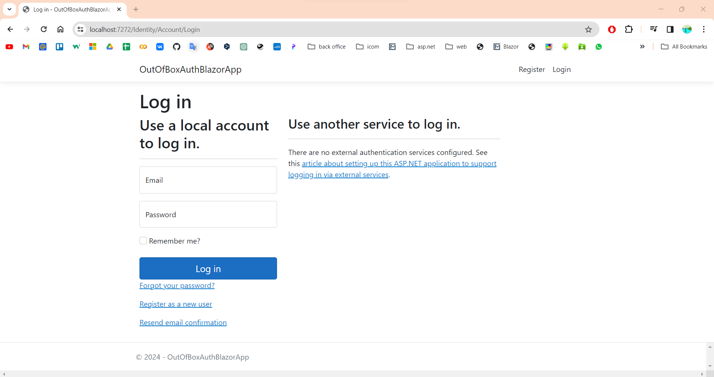
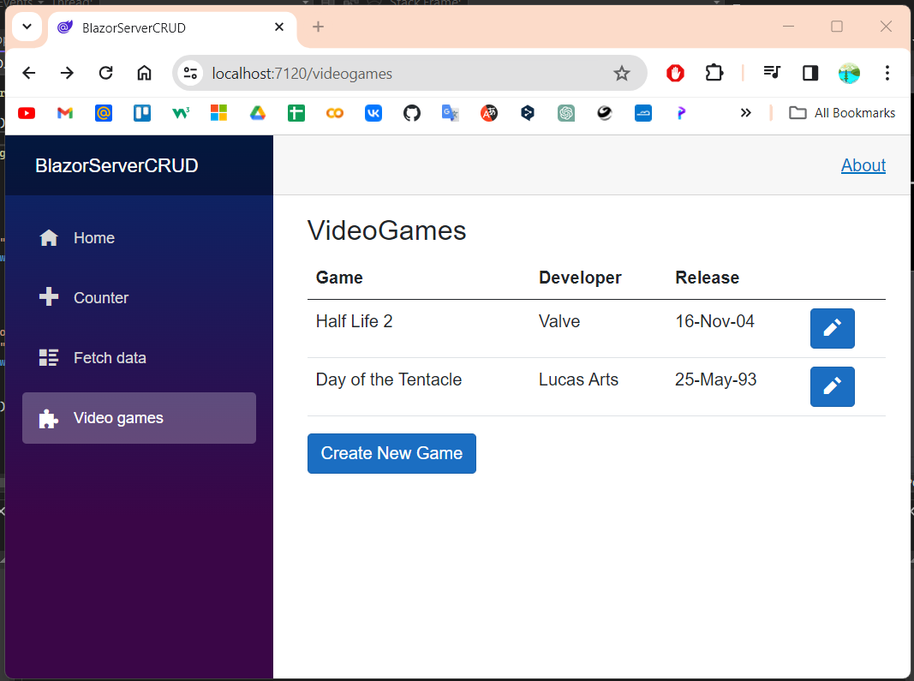

# CRUD and Authorization(Identity Framework) in Blazor Server

## OutOfBoxAuthBlazorApp
OutOfBoxAuthBlazorApp is Authentification and Authorization based on Microsoft.AspNetCore.Identity (Identity Framework) for Blazor Server as example.

## BlazorServerCRUD
BlazorServerCRUD is CRUD for Blazor Server as example.

In Blazor.dox: CRUD and 11.Authentication | Out of the box 